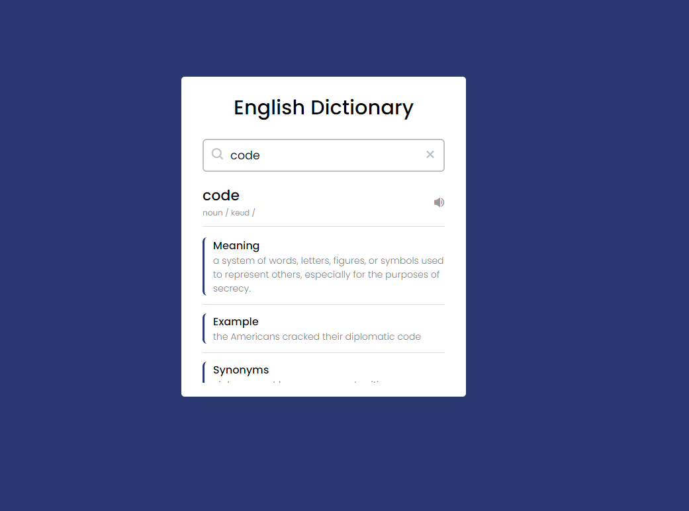

# Dictionary Application using Vanilla JavaScript.

Hello gys this is simple vanilla javascript dictionary application. this design inspired by coding nepla completely. If you wanna contribute it make much better than now! so please you can do that! Thanks

## Using Technologies 
- HTML5/HTML
- CSS3/CSS
- JavaScript
- VS Code Editor
- Git bash/Github
- Dictionary API
- Icon8 (favicon)
and more

### Here is live link to go the live experiences

# Here is demo screenshot about my project! 

> Thanks  for reachout me on Github.